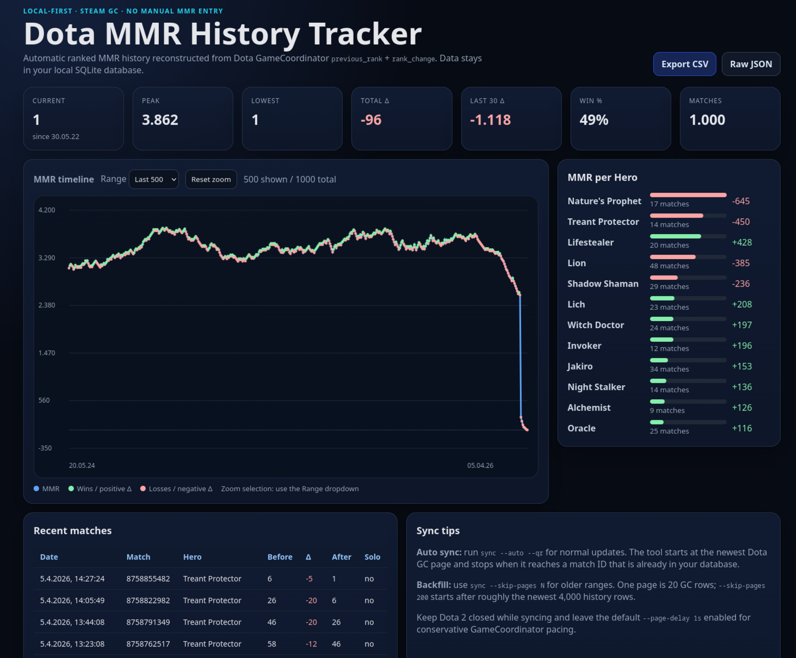

# Dota MMR History Tracker

Local-first Dota 2 MMR history tracker for Linux and Windows.

It logs into Steam locally via Steam Mobile QR auth, connects to the Dota 2 GameCoordinator, reads your own match history, extracts `previous_rank` + `rank_change`, stores the result in SQLite, and serves a local dashboard.

No manual MMR entry. No memory reading. No injection. No overlay hooks. No Dota client patching.

## Showcase



## Features

- QR-based Steam authentication; no Steam password flow in the app
- Automatic incremental sync with `--auto`
- Backfill older ranges with `--skip-pages`
- Local SQLite database
- Local browser dashboard with MMR graph, hover tooltips, hero names, hero stats, and recent matches
- CSV export
- GitHub Release builds for Linux and Windows

## Download

Use the newest GitHub Release:

```text
https://github.com/platzebo/dota-mmr-history-tracker/releases/latest
```

### Linux

Download one of these release assets:

```text
dota-mmr-history-tracker-linux-amd64   # normal Intel/AMD PCs
dota-mmr-history-tracker-linux-arm64   # ARM64 devices
```

Make it executable:

```bash
chmod +x ./dota-mmr-history-tracker-linux-amd64
```

First import the newest part of your MMR history:

```bash
./dota-mmr-history-tracker-linux-amd64 sync \
  --username your_steam_username \
  --qr \
  --matches 5000 \
  --timeout 45m
```

For later updates, use `--auto` so the sync stops when it reaches a match already stored in your database.

Start the dashboard:

```bash
./dota-mmr-history-tracker-linux-amd64 serve
```

Open:

```text
http://127.0.0.1:8789
```

### Windows

Download this release asset:

```text
dota-mmr-history-tracker-windows-amd64.exe
```

Open PowerShell in the download folder and import the newest part of your MMR history:

```powershell
.\dota-mmr-history-tracker-windows-amd64.exe sync `
  --username your_steam_username `
  --qr `
  --matches 5000 `
  --timeout 45m
```

For later updates, use `--auto` so the sync stops when it reaches a match already stored in your database.

Start the dashboard:

```powershell
.\dota-mmr-history-tracker-windows-amd64.exe serve
```

Open:

```text
http://127.0.0.1:8789
```

The tool prints a terminal QR code during sync. Scan/confirm it with the Steam mobile app. After the QR confirmation it connects to Steam CM + Dota GC and imports new ranked MMR rows.

## Commands

The examples below use the Linux binary name. On Windows, replace it with:

```text
.\dota-mmr-history-tracker-windows-amd64.exe
```

### Incremental sync

Use this for normal daily/weekly updates:

```bash
./dota-mmr-history-tracker-linux-amd64 sync \
  --username your_steam_username \
  --qr \
  --auto \
  --timeout 10m
```

`--auto` loads known match IDs from SQLite, starts at the newest GameCoordinator page, imports only rows newer than the first known match, and stops when it sees a known `match_id`.

Important: the default `--matches` value is `500` ranked MMR rows. It is not "all history". With `--auto`, that default is only a safety cap: the sync stops earlier if it reaches a known match. If you have played more than 500 ranked matches since your last sync, pass a larger cap such as `--matches 5000`.

### Initial import / newest history

```bash
./dota-mmr-history-tracker-linux-amd64 sync \
  --username your_steam_username \
  --qr \
  --matches 5000 \
  --timeout 45m
```

### Backfill older history

One Dota GC page is 20 raw match-history rows. To start after roughly the newest 4,000 rows:

```bash
./dota-mmr-history-tracker-linux-amd64 sync \
  --username your_steam_username \
  --qr \
  --skip-pages 200 \
  --matches 5000 \
  --timeout 45m
```

Then continue farther back with `--skip-pages 400`, `--skip-pages 600`, etc. Imports use SQLite upserts, so repeated windows do not duplicate matches.

### Raw debug dump

```bash
./dota-mmr-history-tracker-linux-amd64 sync \
  --username your_steam_username \
  --qr \
  --matches 500 \
  --dump-raw ./dota-gc-history.jsonl
```

### Serve dashboard

```bash
./dota-mmr-history-tracker-linux-amd64 serve
```

Custom address:

```bash
./dota-mmr-history-tracker-linux-amd64 serve --addr 127.0.0.1:8790
```

### Export CSV

```bash
./dota-mmr-history-tracker-linux-amd64 export --out dota-mmr-history-tracker.csv
```

CSV columns:

```text
Date,Unix time,MatchID,Solo Queue,HeroID,Start MMR,Rank Change
```

## Data location

Default SQLite database:

- Linux: `$XDG_CONFIG_HOME/dota-mmr-history-tracker/ledger.sqlite` or `~/.config/dota-mmr-history-tracker/ledger.sqlite`
- Windows: `%AppData%\dota-mmr-history-tracker\ledger.sqlite`

Override it:

```bash
./dota-mmr-history-tracker-linux-amd64 sync --db ./ledger.sqlite --username your_steam_username --qr --auto
./dota-mmr-history-tracker-linux-amd64 serve --db ./ledger.sqlite
```

## Authentication model

The app intentionally supports QR auth and access-token auth only.

Password + Steam Guard code entry is not exposed because it is brittle, timing-sensitive, and encourages unsafe credential handling. QR auth is the intended user flow.

Advanced users can pass an existing Steam access token:

```bash
STEAM_ACCESS_TOKEN='...' ./dota-mmr-history-tracker-linux-amd64 sync --username your_steam_username --auto
```

## Rate-limit note

One sync request/page reads 20 raw history rows. Use conservative batch sizes for large backfills and keep the default `--page-delay 1s` enabled for GameCoordinator pacing.

## Build from source

Requires Go 1.26+.

```bash
go test ./...
go build -o dist/dota-mmr-history-tracker ./cmd/dota-mmr-history-tracker
```

Cross-compile examples:

```bash
GOOS=linux GOARCH=amd64 go build -trimpath -ldflags='-s -w' -o dist/dota-mmr-history-tracker-linux-amd64 ./cmd/dota-mmr-history-tracker
GOOS=windows GOARCH=amd64 go build -trimpath -ldflags='-s -w' -o dist/dota-mmr-history-tracker-windows-amd64.exe ./cmd/dota-mmr-history-tracker
```

## Release builds

GitHub Actions builds release assets automatically when a version tag is pushed:

```bash
git tag v0.1.0
git push origin main --tags
```

The release workflow uploads:

```text
dota-mmr-history-tracker-linux-amd64
dota-mmr-history-tracker-linux-arm64
dota-mmr-history-tracker-windows-amd64.exe
```

The normal `build` workflow still runs tests and uploads CI artifacts for branches and pull requests.

## Architecture

```text
Go CLI
  -> Steam QR auth
  -> Steam CM login with token
  -> mark app 570 as playing
  -> Dota 2 GC ClientHello
  -> CMsgDOTAGetPlayerMatchHistory pages
  -> normalize previous_rank + rank_change rows
  -> SQLite upsert
  -> local HTTP dashboard + CSV export
```

## Security / scope

- Runs locally on your machine
- Does not host a remote service
- Does not ask for Steam password
- Does not persist Steam tokens yet
- Does not inspect Dota memory
- Does not inject into or modify the Dota client
- Uses an undocumented GameCoordinator/protobuf interface that can break if Valve changes it
